下载Ubuntu24.04镜像:
https://ubuntu.com/download/desktop

下载 VMware:
https://www.vmware.com/products/desktop-hypervisor/workstation-and-fusion

--- 

安装教程:(也可参考下面的)
https://blog.csdn.net/hinewcc/article/details/147456712

--- 

一、安装 VMware Workstation Pro 虚拟机
1、官网下载VMware Workstation Pro
链接：https://www.vmware.com/products/desktop-hypervisor/workstation-and-fusion

1.1 选中 "VMware Workstation Pro for PC" 的 "DOWNLOAD NOW"
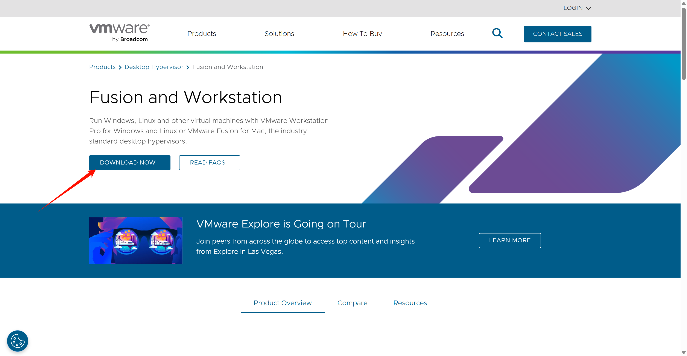

1.2 跳转到broadcom登录页面
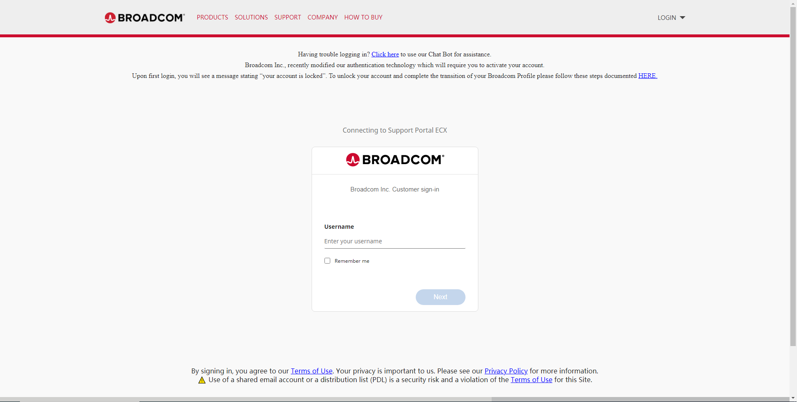

1.3 注册账号
右上角选中 REGISTER

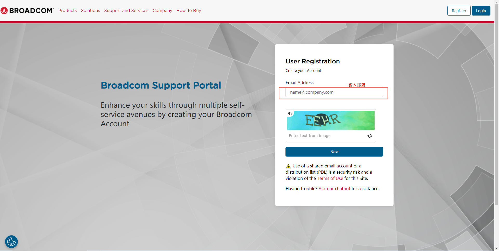

1.4 输入给邮箱收到的验证码信息，然后点击”Verify & Continue“
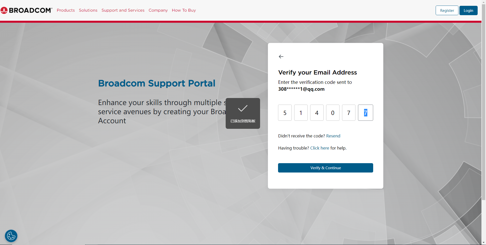

1.5 填写基本信息，然后点击”Create Account“
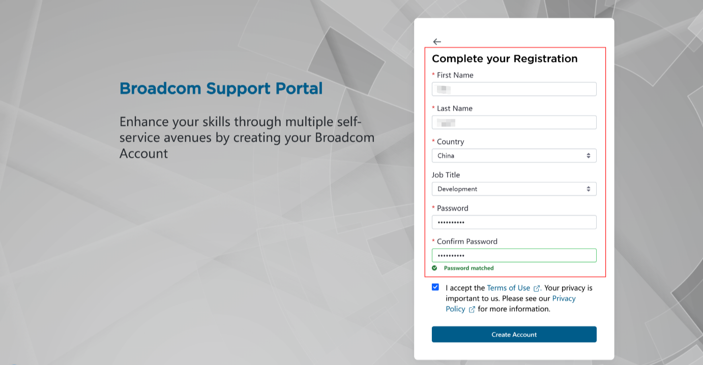

1.6 向下滑，点击”I’ll do it later“
1.7 输入账号、密码进行登录
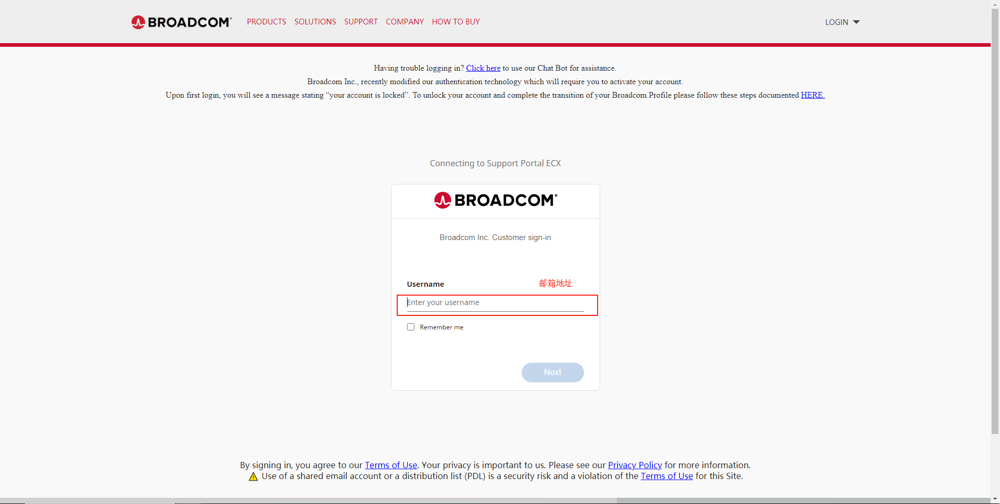

1.8 点击”My Downloads“，选中 "HERE"
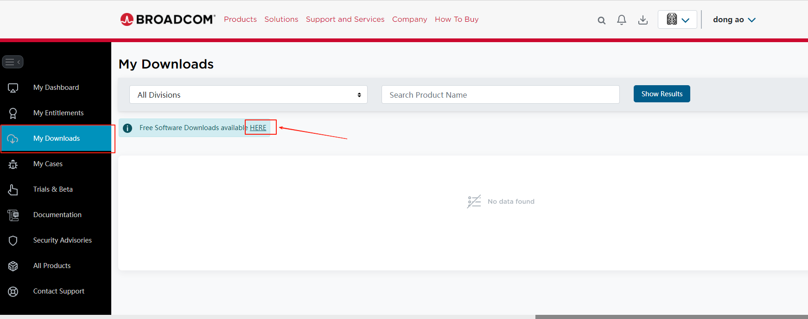

1.9 选中"VMWare Workstation Pro"
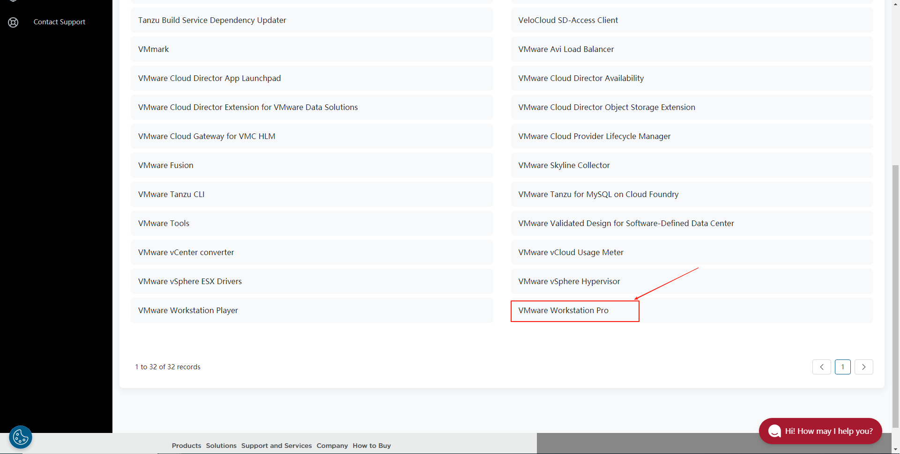

1.10 window下安装虚拟机选 "VMware Workstation Pro 17.0 for Windows"
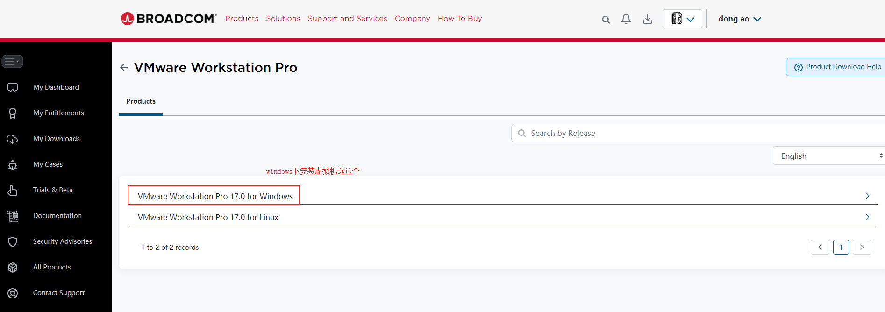

1.11 选中需要的版本(选个最新的就行)
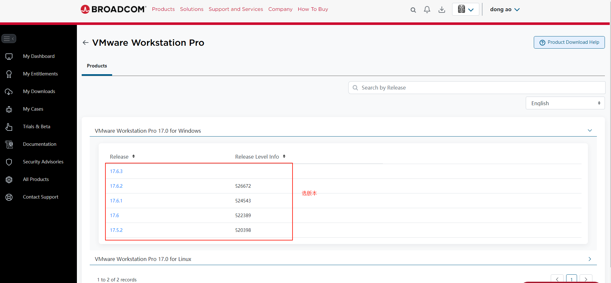

1.12 开始下载
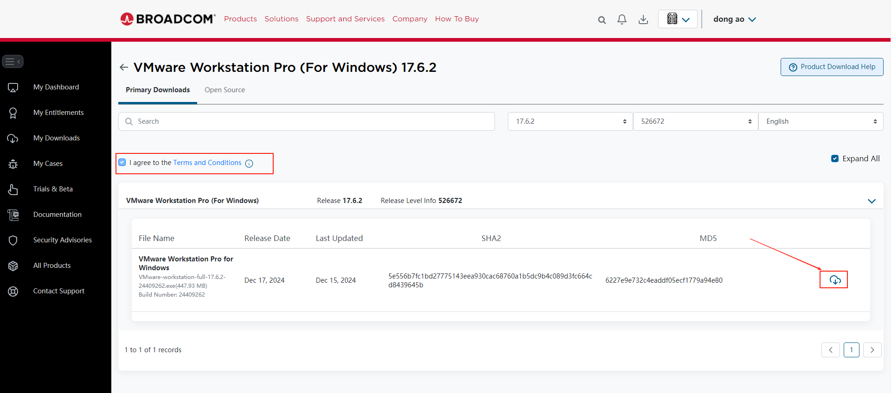

选中 "Yes"
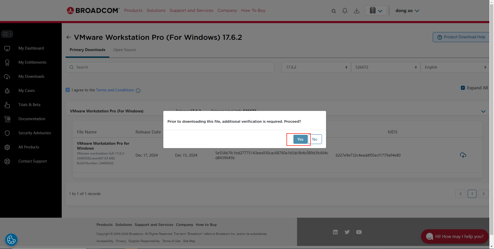

1.13 地址信息随便填下，选中"Submit"
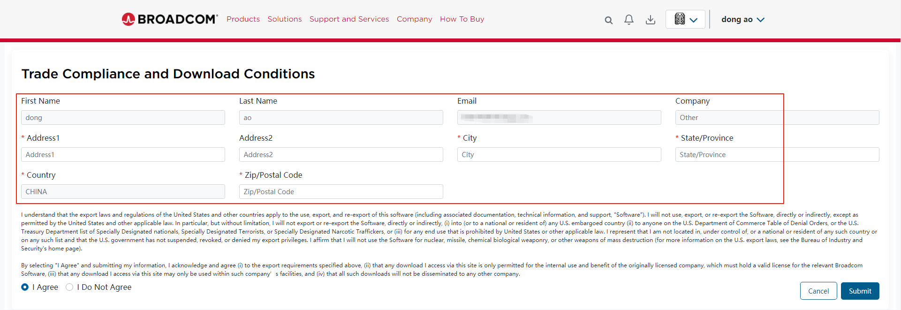

1.14 跳转到这个页面，点击右边的图标，开始下载
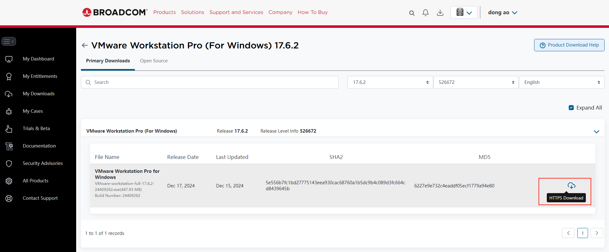

2、安装 VMware Workstation Pro
2.1 双击
2.2 下一步，修改安装位置
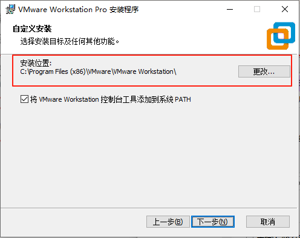

2.3 根据需求，这两项是否勾选
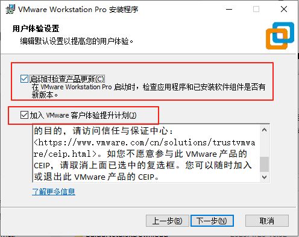

2.4 下一步，安装
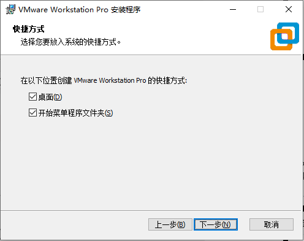
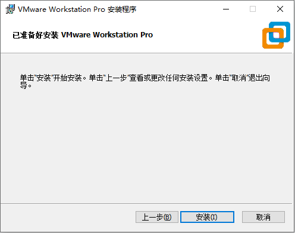

2.5 安装完成，桌面生成快捷方式
说明：VMware Workstation Pro 已转为免费使用（商业、教育和个人用途均适用），最新版本无需许可证密钥即可激活‌！

二、虚拟机上安装Ubuntu
1、下载ubuntu iso镜像
官方链接：https://ubuntu.com/download/desktop

以下载24.04版本为例，Ubuntu24.04LTS，LTS为长期支持的意思
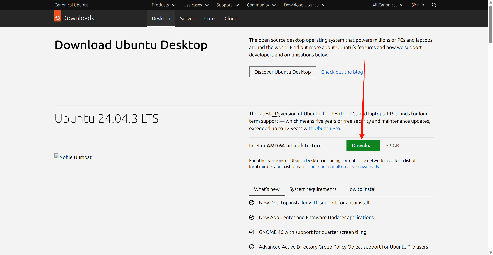

2、VMware Workstation Pro 中创建新的虚拟机
2.1 创建新的虚拟机
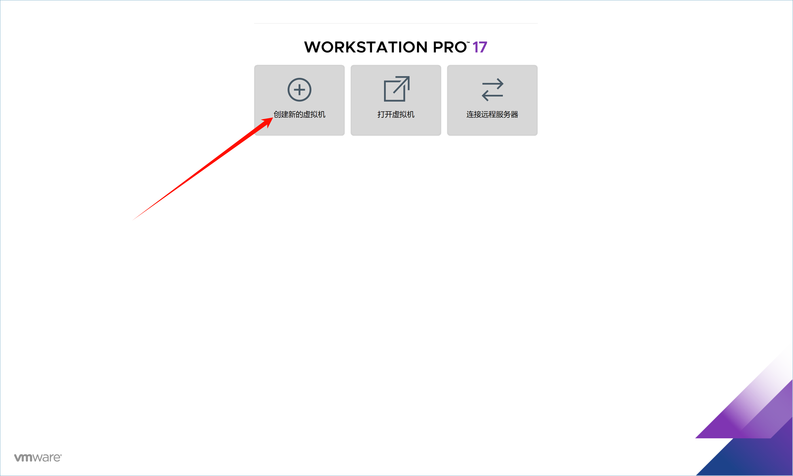

2.2 选择典型 --> 下一步
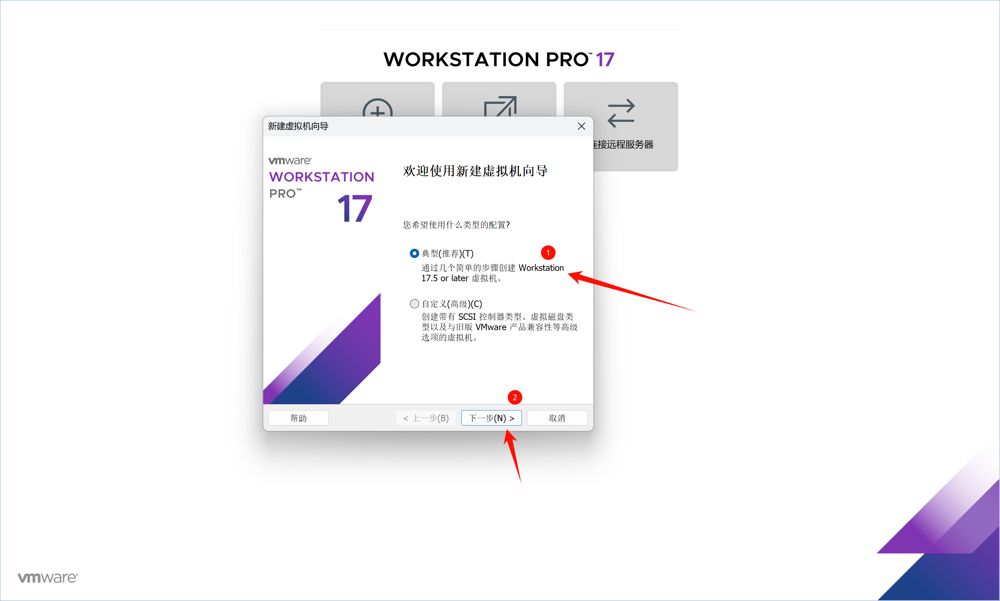

2.3 选择刚刚下载好的 iso 镜像
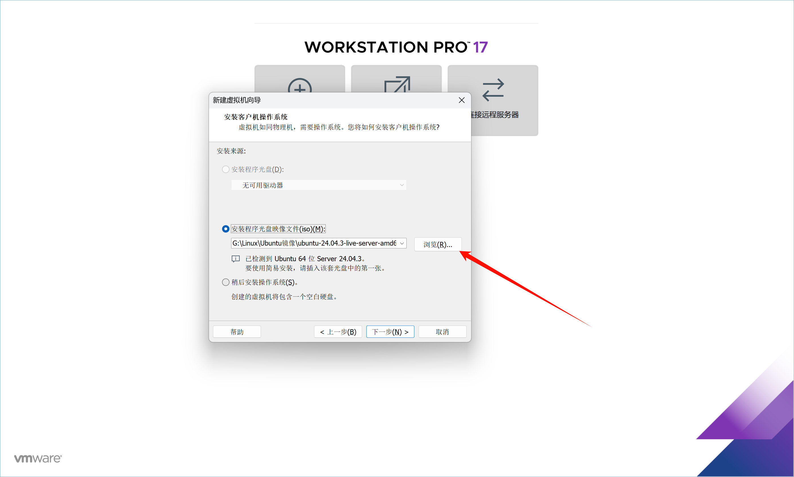

2.4 为虚拟机命名, 设置存储位置
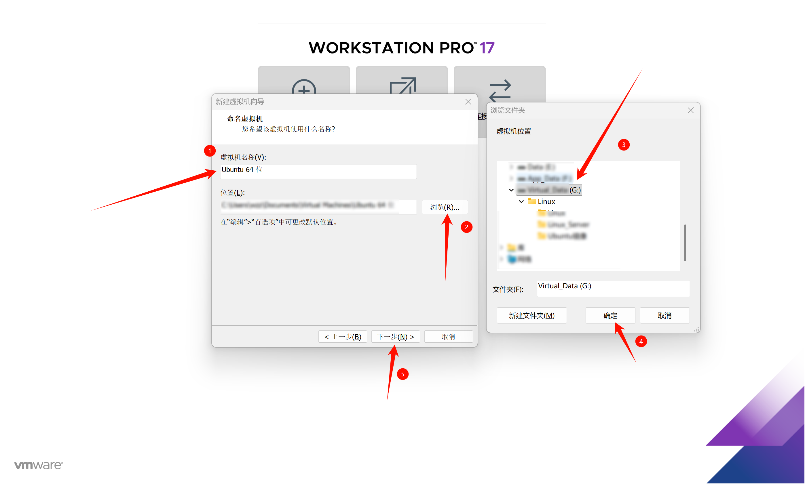

2.5 根据实际情况设置内存大小(>=8G), CPU核心数量(>=4核), 存储空间大小(>=48G)
*如果可以不要设置得太小, 如果设置得太小, 会导致系统卡顿*

2.6 后面开机后根据引导安装即可(注意引导安装时设置的用户是无法sudo提权的, 后面需要删除这个用户创建新的所以不要使用真正要用的用户名)
2.7 根据实际情况更换 apt 源
https://mirrors.tuna.tsinghua.edu.cn/help/ubuntu/
