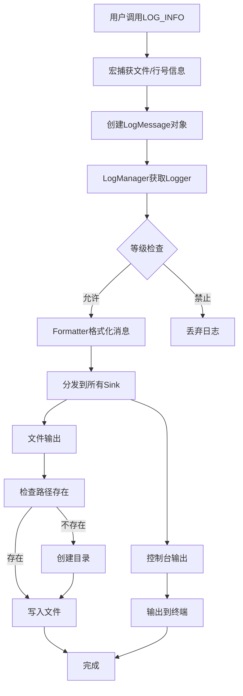

```mermaid
%% 流程图部分
flowchart TD
    Start[用户调用LOG_INFO] --> Capture[宏捕获文件/行号信息]
    Capture --> CreateMsg[创建LogMessage对象]
    CreateMsg --> GetLogger[LogManager获取Logger]
    GetLogger --> CheckLevel{等级检查}
    
    CheckLevel -->|允许| Format[Formatter格式化消息]
    CheckLevel -->|禁止| Discard[丢弃日志]
    
    Format --> Distribute[分发到所有Sink]
    
    Distribute --> FileSink[文件输出]
    Distribute --> ConsoleSink[控制台输出]
    
    FileSink --> CheckPath[检查路径存在]
    CheckPath -->|存在| WriteFile[写入文件]
    CheckPath -->|不存在| CreateDir[创建目录] --> WriteFile
    
    ConsoleSink --> Print[输出到终端]
    
    WriteFile --> Done[完成]
    Print --> Done

```